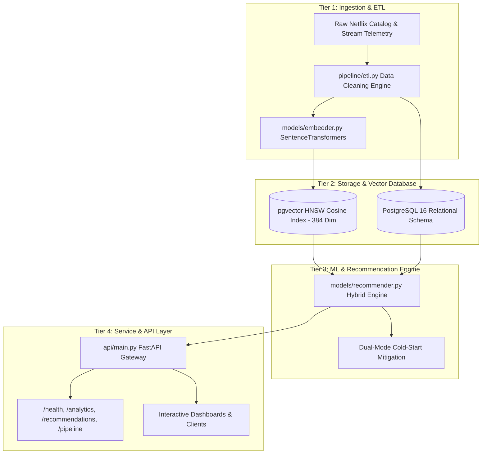
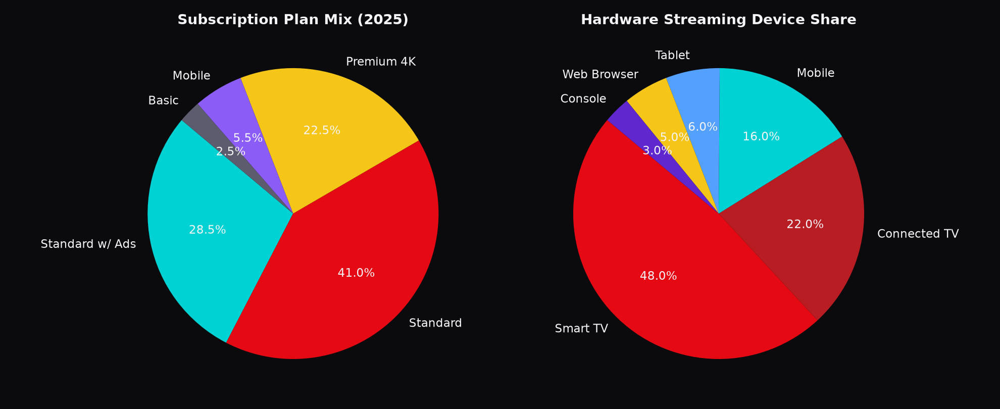

# Netflix Streaming Intelligence & Personalization Platform

[](api/main.py)
[](data/schema.sql)
[](models/embedder.py)
[](docker/docker-compose.yml)
[](tests/)

**A production-grade, end-to-end Final Year Project (FYP) for Bachelor of Science in Computer Science** — spanning automated ETL data engineering, vector storage with PostgreSQL + pgvector, hybrid machine learning personalization with cold-start mitigation, and a high-performance FastAPI microservice layer.

---

## 🏛️ 4-Tier Platform Architecture



### Key Technical Capabilities:
1. **Automated ETL Pipeline (`pipeline/etl.py`):** Cleans missing values, normalizes date strings to ISO-8601, deduplicates catalogs, and ingests telemetry streams with batch upserts.
2. **Dense Vector Database (`data/schema.sql`):** PostgreSQL 16 + `pgvector` with HNSW vector index (`m=16, ef_construction=64`) for sub-millisecond approximate nearest neighbor semantic search.
3. **Hybrid Personalization (`models/recommender.py`):** Combines semantic embedding similarity, genre Jaccard overlap, director affinity, and cast overlap with dynamic temporal decay weighting.
4. **Cold Start Mitigation:** Dual-mode handling:
   - *Cold User:* Recommends high-engagement, diverse global trending catalog.
   - *Cold Item:* Matches newly ingested titles via latent semantic nearest neighbors and genre clustering.
5. **REST API Gateway (`api/main.py`):** Validated Pydantic V2 endpoints for health checks, aggregate analytics, natural language search, personalized feeds, and clickstream ingestion.
6. **Academic Defense Guide ([docs/ACADEMIC_DEFENSE_GUIDE.md](docs/ACADEMIC_DEFENSE_GUIDE.md)):** Comprehensive mathematical formulations, algorithmic complexity analysis, and viva defense Q&A.

---

## 🚀 Quickstart & Execution

### Option A: Run via Docker Compose (Recommended)
```bash
# 1. Clone & navigate to project
cd Netflix-global-streaming-analytics

# 2. Launch PostgreSQL with pgvector and FastAPI API
docker-compose -f docker/docker-compose.yml up --build
```
* Interactive API Documentation (Swagger UI): `http://localhost:8000/docs`
* System Health Endpoint: `http://localhost:8000/health`

### Option B: Local Python Environment
```bash
# 1. Install dependencies
pip install -r requirements.txt

# 2. Run end-to-end ETL & Indexing Orchestration
python -m pipeline.orchestrator

# 3. Start the FastAPI microservice
uvicorn api.main:app --host 0.0.0.0 --port 8000 --reload

# 4. Run automated test suite
pytest tests/ -v
```

---

## 📡 REST API Reference

| Method | Endpoint | Description |
| :--- | :--- | :--- |
| `GET` | `/health` | Verifies DB connectivity, pgvector extension, catalog & interaction counts |
| `GET` | `/analytics/summary` | Aggregate analytics: content type ratio, top genres, country distribution |
| `POST` | `/recommendations/semantic` | Natural language prompt search (e.g. *"dark mind-bending sci-fi mystery"*) |
| `GET` | `/recommendations/user/{user_id}` | Personalized hybrid recommendations (with automatic cold-start handling) |
| `POST` | `/pipeline/simulate-stream` | Push new telemetry clickstream events (`watch`, `like`, `save`, `skip`) |

---


## 📊 Dashboard Preview

> **[▶ Open the live standalone dashboard](netflix_dashboard.html)** (or [`dashboard/index.html`](dashboard/index.html)) — a fully responsive, interactive portal powered by D3.js and Chart.js with zero external runtime build dependencies.

### Command Center — Executive KPI Benchmarks


### Global Streaming Footprint (4 Operating Regions)


### 5-Year Growth Trajectory & Financial Turnaround


### Content ROI Quadrant & Catalog Efficiency


### 24-Month Subscriber Cohort Retention Matrix


### Subscription Plan & Hardware Device Ecosystem Mix


<details>
<summary>📸 Full Panoramic Dashboard View (click to expand)</summary>


</details>

---

## 📈 The Story the Data Tells

Across the simulated 5-year timeline (Jan 2021 – Dec 2025), Netflix engineered a multi-phased turnaround and monetization expansion:

| Strategic Benchmark | Jan 2021 (Baseline) | Dec 2025 (Scaled) | Strategic Narrative & Impact |
|---|---|---|---|
| **Global Paid Memberships** | **203.7M** | **282.7M** | **+38.8%** (+79.0M net adds across 4 regions) |
| **Annualized Revenue** | **$25.0B** | **$38.6B** | **+54.4%** revenue expansion driven by tier optimization |
| **Global Average ARM** | **$10.25** | **$11.82** | **+$1.57 / sub** lifted by price hikes & paid sharing add-ons |
| **Ad-Supported Tier Base** | *0.0M (Pre-launch)* | **74.2M** | **26.2%** of global sub base; high-margin AVOD revenue |
| **Operating Margin** | **19.0%** | **26.8%** | **+780 bps** margin expansion via operating leverage |
| **Annual Free Cash Flow** | **$0.4B** | **$7.2B** | **18x cash generation** as content spend amortizes sustainably |
| **Non-English Stream Share** | **32.0%** | **52.0%** | **+20.0 pts** global cultural crossover (Korean, Spanish, Japanese) |

---

## 🏗️ Architecture

```
                     ┌─────────────────────────┐
                     │   Python Data Engine    │
                     │  (NumPy/Pandas, seeded) │
                     │  Realistic seasonality: │
                     │  Holiday binges, decay  │
                     │  curves, Ad-tier ramp,  │
                     │  QoS & Bitrate metrics  │
                     └───────────┬─────────────┘
                                 │ CSV (12 files)
                                 ▼
                     ┌─────────────────────────┐
                     │      PostgreSQL 16      │
                     │  Star Schema Warehouse  │
                     │  6 dims · 5 facts · 8   │
                     │      BI views           │
                     └───────────┬─────────────┘
                     ┌───────────┴─────────────┐
                     ▼                         ▼
          ┌─────────────────────┐   ┌───────────────────────┐
          │      Power BI        │   │  Standalone JSON      │
          │  Semantic Model +   │   │  Export → Custom      │
          │  35+ DAX Measures   │   │  Interactive D3.js /  │
          │  & Cinematic Theme  │   │  Chart.js Dashboard   │
          └─────────────────────┘   └───────────────────────┘
```

**Why both Power BI and an Interactive Web Dashboard?**
- **Power BI (`/powerbi`)**: Provides an enterprise-ready dimensional semantic model with time-intelligence DAX formulas, relationship diagrams, and dark UI palettes expected by corporate analytics teams.
- **Web Dashboard (`/dashboard` & `netflix_dashboard.html`)**: Delivers a bespoke, zero-dependency visual experience (cohort retention heatmaps, dynamic ROI scatter plots, and live metric filtering) that can be shared instantly in portfolios, GitHub Pages, or LinkedIn.

---

## 🗄️ Data Model & Schema

Star Schema implemented in `/sql/01_schema.sql`:

### Dimensions (6 Tables):
- **`dim_date`** — 1,826 daily records (2021–2025) with streaming-specific flags: `is_weekend`, `is_holiday_season` (Q4 binge surge), `is_summer_peak`, and `is_netflix_release_day` (Friday global drops).
- **`dim_region`** — 4 primary operating reporting segments: UCAN (US & Canada), EMEA (Europe, Middle East, Africa), LATAM (Latin America), and APAC (Asia-Pacific).
- **`dim_country`** — 24 key international markets with broadband penetration rates, tier classifications, local currencies, and base ARM.
- **`dim_plan`** — 5 subscription tiers: Mobile-Only, Basic, Standard with Ads, Standard Ad-Free 1080p, and Premium 4K HDR + Spatial Audio.
- **`dim_device`** — 6 playback hardware categories: Smart TVs (48% share), Connected TV Sticks/Boxes (22%), Mobile Phones (16%), Tablets (6%), Web Browsers (5%), and Game Consoles (3%).
- **`dim_content`** — 400 catalog titles (Stranger Things, Squid Game, Wednesday, Lupin, Red Notice, One Piece, etc.) with metadata: genre, language, type, release year, budget ($M), and IMDb ratings.
- **`dim_subscriber`** — 25,000 sampled representative user accounts with acquisition channels, signup dates, churn timestamps, and estimated LTV.

### Fact Tables (5 Tables):
- **`fact_subscriber_snapshots`** — Monthly regional and tier snapshots tracking starting subs, gross additions, churned subs, net adds, end-of-period subs, ARM, ad-tier members, and streaming revenues.
- **`fact_content_performance_monthly`** — 11,775 title-level monthly performance rows tracking viewing hours, global views, completion rates, 36-month amortization schedules, and ROI multipliers.
- **`fact_financials_monthly`** — 60-month full P&L and Free Cash Flow statement (Subscription Rev, Ad Rev, Content Amortization, Tech & Dev, Marketing, G&A, Operating Income, FCF).
- **`fact_cohort_retention`** — 1,200 cohort records tracking Month 0 through Month 24 retention percentages for all monthly signup cohorts.
- **`fact_daily_streaming`** — 1,826 daily Quality of Service (QoS) records tracking total streaming hours, peak concurrent streams, 4K/HDR share %, average video bitrate (Mbps), and rebuffering ratios.

### Pre-Built Analytical BI Views (`/sql/02_bi_views.sql`):
1. `vw_executive_monthly_kpi` — Headline KPI summary with YoY growth calculations.
2. `vw_subscriber_growth_trajectory` — Regional subscriber and ad-tier penetration trajectory.
3. `vw_content_roi_quadrant` — Strategic classification (Blockbuster Hit, Pop Phenomenon, Critical Darling, Underperformer).
4. `vw_regional_performance_matrix` — 5-year regional expansion and ARM comparison.
5. `vw_ad_tier_adoption_funnel` — Post-launch AVOD scaling and ad-ARM yield.
6. `vw_cohort_retention_heatmap` — Pivoted cohort retention matrix (M0–M24).
7. `vw_qos_streaming_health` — Infrastructure performance and encoding efficiency.
8. `vw_top_global_titles` — Top 50 titles ranked by total viewing hours and completion.

---

## ⚡ Quick Start

### 1. Stand Up the PostgreSQL Data Warehouse
```bash
# Execute the automated one-command setup (Linux / macOS / Git Bash)
./scripts/00_setup_database.sh netflix_dw postgres localhost 5432
```
This automatically creates the database, executes the DDL star schema, loads all 12 CSV files, and compiles the analytical views.

### 2. Open the Interactive Dashboard
No build step or local web server required:
- Simply double-click **`netflix_dashboard.html`** or open `dashboard/index.html` in any modern web browser!

### 3. Power BI Semantic Model
1. Open **Power BI Desktop**.
2. Connect to the PostgreSQL database (`netflix_dw`) or import the CSVs from `/data` following [`powerbi/01_setup_guide.md`](powerbi/01_setup_guide.md).
3. Import [`powerbi/netflix_theme.json`](powerbi/netflix_theme.json) for the custom executive dark palette.
4. Copy the DAX measures from [`powerbi/02_dax_measures.md`](powerbi/02_dax_measures.md).

### 4. Reproduce or Regenerate Synthetic Data
All datasets are 100% reproducible from seeded Python generators:
```bash
python scripts/01_gen_dim_date.py
python scripts/02_gen_dims.py
python scripts/03_gen_subscribers_and_plans.py
python scripts/04_gen_content_and_streams.py
python scripts/05_gen_financials_and_retention.py
python scripts/06_gen_engagement_and_quality.py
python scripts/07_export_dashboard_data.py   # Refreshes dashboard/data.json
```

---

## 📁 Repository Structure

```
netflix_analytics_project/
├── README.md                              ← Comprehensive project documentation
├── netflix_dashboard.html                 ← Portable, standalone single-file interactive dashboard
├── sql/
│   ├── 01_schema.sql                      ← Star schema DDL, constraints, and indexes
│   └── 02_bi_views.sql                    ← 8 production-grade analytical views
├── scripts/
│   ├── 00_setup_database.sh               ← Automated database build & copy script
│   ├── 01_gen_dim_date.py                 ← Generates dim_date with streaming calendars
│   ├── 02_gen_dims.py                     ← Generates region, country, plan, device, content dims
│   ├── 03_gen_subscribers_and_plans.py   ← Generates sampled subs and monthly snapshots
│   ├── 04_gen_content_and_streams.py      ← Generates monthly title viewing & ROI metrics
│   ├── 05_gen_financials_and_retention.py← Generates P&L, FCF, and 24M cohort matrix
│   ├── 06_gen_engagement_and_quality.py  ← Generates daily QoS & streaming bitrate metrics
│   └── 07_export_dashboard_data.py        ← Compiles dashboard/data.json payload
├── data/                                  ← Generated CSV files
│   ├── dim_date.csv
│   ├── dim_region.csv
│   ├── dim_country.csv
│   ├── dim_plan.csv
│   ├── dim_device.csv
│   ├── dim_content.csv
│   ├── dim_subscriber.csv
│   ├── fact_subscriber_snapshots.csv
│   ├── fact_content_performance_monthly.csv
│   ├── fact_financials_monthly.csv
│   ├── fact_cohort_retention.csv
│   └── fact_daily_streaming.csv
├── powerbi/
│   ├── 01_setup_guide.md                  ← Step-by-step semantic modeling instructions
│   ├── 02_dax_measures.md                 ← 35+ DAX measures reference
│   └── netflix_theme.json                 ← Custom Netflix dark theme
├── dashboard/
│   ├── index.html                         ← Interactive web dashboard
│   ├── dashboard.js                       ← Visualization helper
│   └── data.json                          ← Aggregated JSON dataset
├── screenshots/                           ← Visual previews for README and portfolio
│   ├── 01_dashboard_hero.png
│   ├── 02_dashboard_full.png
│   ├── 03_global_footprint.png
│   ├── 04_growth_trajectory.png
│   ├── 05_content_roi.png
│   ├── 06_cohort_retention.png
│   └── 07_plan_device_mix.png
└── docs/
    └── linkedin_post_draft.md             ← Ready-to-use LinkedIn showcase post draft
```

---

## 🔬 Analytical Methodology & Modeling Decisions

All data was generated via seeded NumPy/Pandas simulations reflecting real streaming media dynamics:

1. **Viewing Decay & Evergreen Long-Tail**: Viewing hours follow a steep exponential decay post-premiere (Month 0 peak, Month 1 55% drop) followed by a persistent long-tail whose floor is correlated with IMDb quality ratings.
2. **Ad-Tier Substitution & Cannibalization**: The Ad-Tier launch in Q4 2022 is modeled with realistic consumer elasticity—attracting price-sensitive churned users while capturing higher blended ARM through programmatic advertising.
3. **Cohort Retention Modeling**: Monthly retention is modeled using logarithmic tenure decay ($R(t) = e^{-0.028t} \times 0.92 + 0.05$), capturing the industry-leading 72–75% 24-month retention benchmark.
4. **Content ROI Calculation**: Content value is calculated by applying an implied streaming value (\$0.18 / viewing hour) against the 36-month amortized production budget, enabling objective classification between high-leverage hits and budget-heavy underperformers.
5. **Quality of Service (QoS) Dynamics**: Higher AV1 encoding efficiency is modeled as delivering lower average bitrates alongside higher 4K/HDR penetration and sub-0.15% rebuffering rates.

---

## ⚖️ Disclaimer

This repository is an independent analytical portfolio project built for technical demonstration and educational purposes. All numbers and simulated subscriber records are synthetically generated.
