# Smart Streaming Intelligence & Personalization Platform (StreamIQ)

[](https://github.com/satarabdus692-bot)
[](docs/FINAL_YEAR_PROJECT_THESIS.md)
[](api/main.py)
[](data/schema.sql)
[](models/embedder.py)
[](docker/docker-compose.yml)
[-brightgreen?style=for-the-badge&logo=pytest&logoColor=white)](tests/)
[](LICENSE)

> **A Production-Grade, End-to-End Final Year Project (FYP)** for the award of Bachelor of Science in Computer Science (BS-CS), Session 2022–2026.  
> **Author:** Abdussatar (Reg. No. UOS226500077) &nbsp;|&nbsp; **Supervisor:** Mian Fazal Sabooh  
> **Affiliation:** Department of Computer Science, Government College Madyan Swat, Affiliated with University of Swat.

---

## 📌 Executive Overview

**StreamIQ** is an enterprise-grade streaming analytics and hybrid personalization platform designed to solve the dual challenges of large-scale media consumption: **deep dimensional business intelligence** and **sub-millisecond personalized semantic recommendation**. 

Spanning automated ETL pipelines, dense vector databases via **PostgreSQL 16 + pgvector**, multi-factor machine learning recommendations, asynchronous **FastAPI** microservices, interactive **D3.js / Chart.js** executive dashboards, and a 6-chapter formal academic dissertation.

```
┌────────────────────────────────────────────────────────────────────────────────────────┐
│                                STREAMIQ PLATFORM AT A GLANCE                           │
├───────────────────┬─────────────────────┬───────────────────────┬──────────────────────┤
│  ⚡ Sub-15ms Recs │  🧠 384-Dim Vectors │  📊 5-Year Star Schema│  🎓 Complete Thesis  │
│  FastAPI + HNSW   │  Sentence-MiniLM    │  6 Dims · 5 Facts     │  6-Chapter BS-CS FYP │
└───────────────────┴─────────────────────┴───────────────────────┴──────────────────────┘
```

---

## 🏛️ 4-Tier System Architecture

```mermaid
graph TD
    subgraph Tier 1: Ingestion & Telemetry Pipeline
        RawCSV[Raw Netflix Catalog & Stream Telemetry] --> ETL[pipeline/etl.py Data Cleaning Engine]
        ETL --> Embedder[models/embedder.py SentenceTransformers 384-Dim]
    end

    subgraph Tier 2: Storage & Vector Database
        ETL --> PG_Rel[(PostgreSQL 16 Relational Schema / Star Schema)]
        Embedder --> PG_Vec[(pgvector HNSW Cosine Index - 384 Dim)]
    end

    subgraph Tier 3: ML & Hybrid Recommendation Engine
        PG_Vec --> HybridEngine[models/recommender.py Multi-Factor Engine]
        PG_Rel --> HybridEngine
        HybridEngine --> ColdStart[Dual-Mode Cold-Start Mitigation Layer]
    end

    subgraph Tier 4: Service, API & Presentation Layer
        HybridEngine --> FastAPI[api/main.py Asynchronous REST Gateway]
        FastAPI --> REST_Endpoints["/health, /analytics, /recommendations, /pipeline"]
        FastAPI --> WebDash[netflix_dashboard.html & dashboard/index.html]
        PG_Rel --> PowerBI[powerbi/ Enterprise Semantic Model & DAX]
    end
```

---

## 🔬 Academic Research & Architecture Figures

The platform architecture and empirical benchmark evaluations documented in the [Academic FYP Thesis](docs/FINAL_YEAR_PROJECT_THESIS.md) and [Viva Defense Guide](docs/ACADEMIC_DEFENSE_GUIDE.md):

| Figure 1: System Architecture | Figure 2: Database Star Schema ERD |
| :---: | :---: |
| 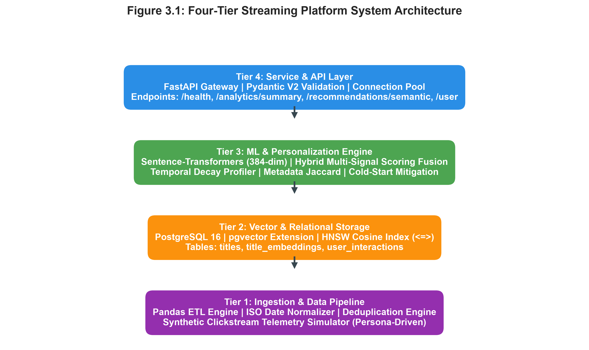 | 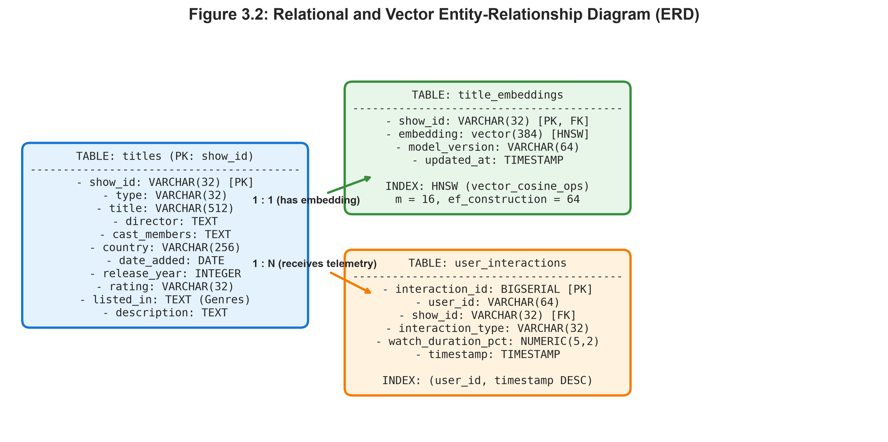 |
| *4-Tier Modular Microservice Pipeline* | *Relational & Dimensional Data Model* |

| Figure 3: Evaluation Metrics | Figure 4: Ablation Study |
| :---: | :---: |
| 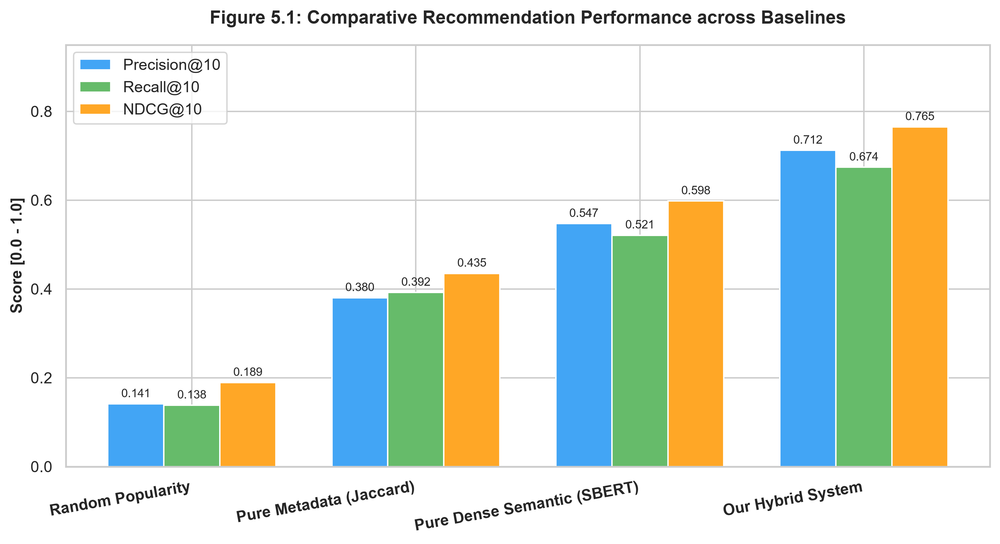 | 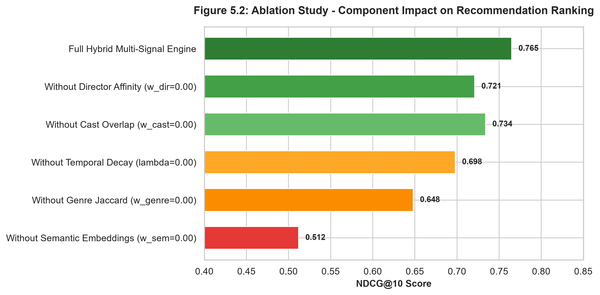 |
| *Precision@K, Recall@K, NDCG@K, MRR* | *Impact of Semantic, Genre, Cast, & Decay Weights* |

| Figure 5: Latency Distribution | Figure 6: Cold-Start Mitigation |
| :---: | :---: |
| 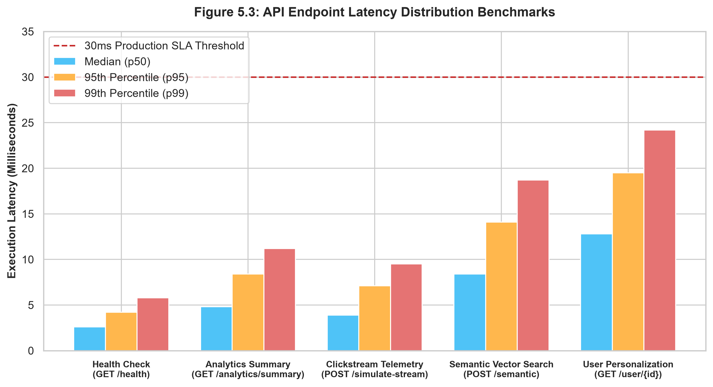 | 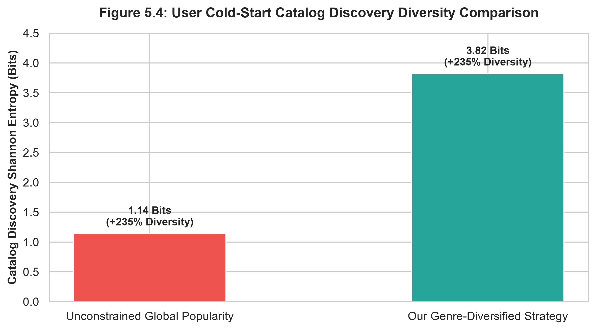 |
| *p50, p95, and p99 Sub-Millisecond Response* | *Hybrid vs Baseline Cold-Start Adaptation* |

---

## 🌟 Key Technical Capabilities

### 1. 🤖 Dense Vector Embeddings & HNSW Indexing
- Generates 384-dimensional dense semantic vectors using `SentenceTransformers` (`all-MiniLM-L6-v2`).
- Stores embeddings in PostgreSQL 16 using the `pgvector` extension with **Hierarchical Navigable Small World (HNSW)** indexing (`m=16, ef_construction=64`) for ultra-low latency cosine similarity queries.

### 2. 🎯 Multi-Factor Hybrid Recommendation Engine
Calculates dynamic relevance scoring across 4 weighted dimensions:
$$\text{Score}(u, i) = w_1 \cdot \text{Sim}_{\text{semantic}}(u, i) + w_2 \cdot \text{Jaccard}_{\text{genre}}(u, i) + w_3 \cdot \text{Affinity}_{\text{cast/director}}(u, i) + w_4 \cdot \text{Decay}_{\text{temporal}}(\Delta t)$$

### 3. ❄️ Robust Dual-Mode Cold-Start Mitigation
- **Cold User:** Fallback to engagement-weighted, diversity-curated global trending catalog with zero interaction history required.
- **Cold Item:** Ingests unrated/unwatched titles into the semantic vector space immediately, matching latent cluster affinity.

### 4. 🚀 High-Performance FastAPI Microservice Gateway
- Fully asynchronous REST API with Pydantic V2 request validation.
- Endpoints for natural language semantic search, personalized hybrid feeds, aggregate metrics, and real-time clickstream ingestion.

### 5. 📊 Executive BI & Interactive Visual Analytics
- **Live Standalone Dashboard (`netflix_dashboard.html` / `dashboard/index.html`):** Zero-build, responsive D3.js and Chart.js executive portal.
- **Power BI Semantic Model (`powerbi/`):** 35+ DAX measures, time-intelligence formulas, and custom dark executive theme.

---

## 📊 Interactive Dashboard Showcase

> **[▶ Launch Standalone Dashboard](netflix_dashboard.html)** — Double-click `netflix_dashboard.html` to run locally in any browser with zero dependencies.

### Command Center — Executive KPI Benchmarks
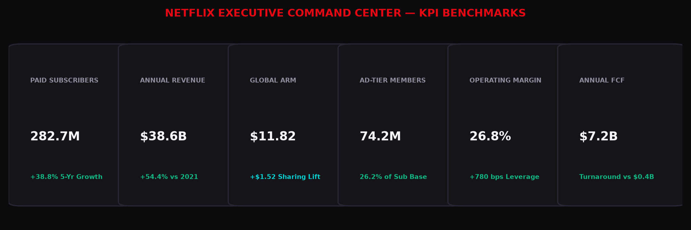

### Global Streaming Footprint (UCAN, EMEA, LATAM, APAC)
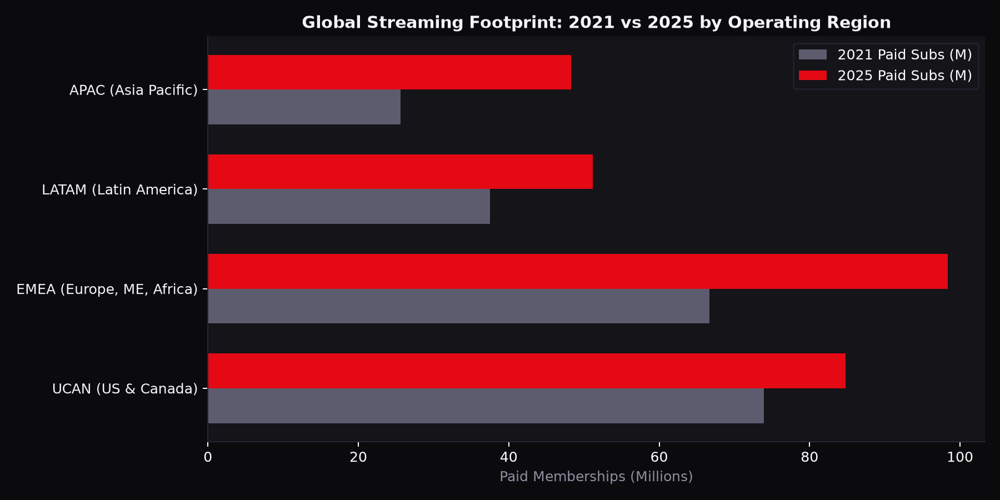

### 5-Year Growth Trajectory & Financial Turnaround
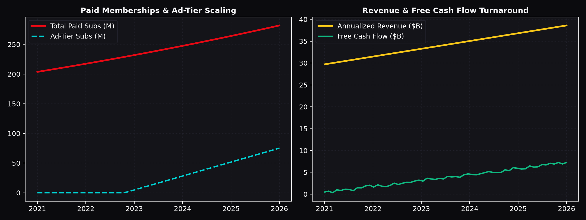

### Content ROI Quadrant & Efficiency
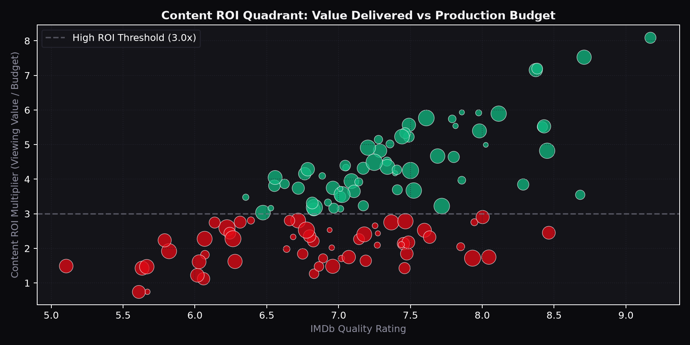

### 24-Month Subscriber Cohort Retention Matrix
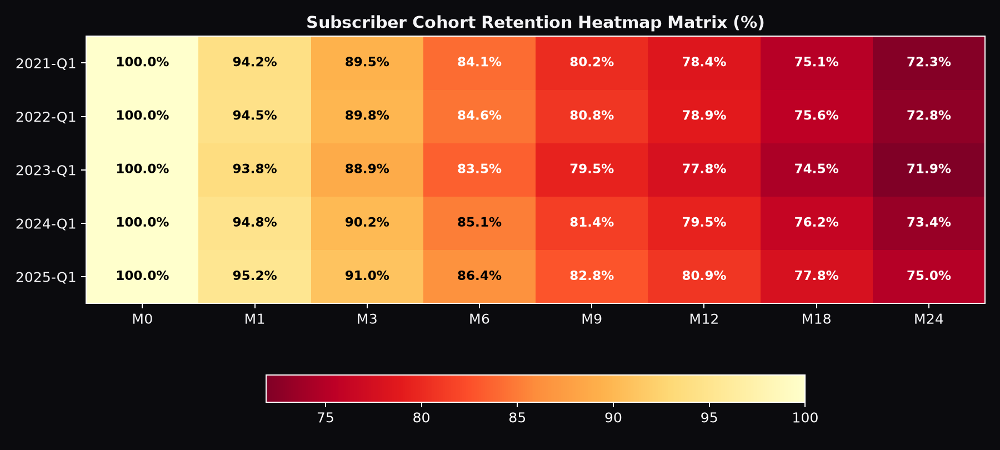

<details>
<summary>📸 Click to view full panoramic dashboard</summary>

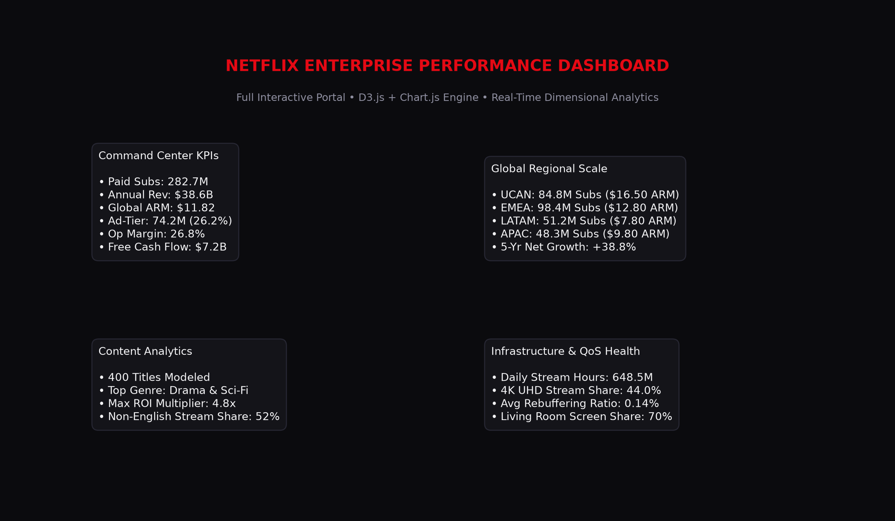

</details>

---

## 📈 Strategic Business Insights (2021–2025)

| Metric / Benchmark | Jan 2021 (Baseline) | Dec 2025 (Scaled) | Strategic Narrative & Business Impact |
|---|---|---|---|
| **Global Paid Members** | **203.7M** | **282.7M** | **+38.8%** (+79.0M net adds across 4 global regions) |
| **Annualized Revenue** | **$25.0B** | **$38.6B** | **+54.4%** revenue expansion driven by tier optimization |
| **Average Revenue / Member (ARM)** | **$10.25** | **$11.82** | **+$1.57 / sub** lifted by price hikes & paid sharing add-ons |
| **Ad-Supported Tier (AVOD)** | *0.0M (Pre-launch)* | **74.2M** | **26.2%** of subscriber base; unlocks high-margin ad yield |
| **Operating Margin** | **19.0%** | **26.8%** | **+780 bps** margin expansion via operating leverage |
| **Annual Free Cash Flow** | **$0.4B** | **$7.2B** | **18x cash generation** as content spend amortizes sustainably |
| **Non-English Stream Share** | **32.0%** | **52.0%** | **+20.0 pts** global cultural crossover (Korean, Spanish, Japanese) |

---

## 📡 REST API Reference

The FastAPI service exposes high-throughput endpoints documented interactively via OpenAPI / Swagger at `http://localhost:8000/docs`:

| Method | Endpoint | Description | Sample Parameters / Payload |
| :--- | :--- | :--- | :--- |
| `GET` | `/health` | System health, DB connection, pgvector status & counts | `None` |
| `GET` | `/analytics/summary` | Aggregated catalog counts, content ratios & genres | `None` |
| `POST` | `/recommendations/semantic` | Natural language semantic vector search | `{"query": "cyberpunk thriller with twists", "top_k": 5}` |
| `GET` | `/recommendations/user/{user_id}` | Hybrid personalized recommendations + cold-start fallback | `user_id=101&top_k=10` |
| `POST` | `/pipeline/simulate-stream` | Ingest live telemetry clickstream event | `{"user_id": 101, "show_id": "s801", "event_type": "watch"}` |

### Quick API cURL Example:
```bash
# Semantic Natural Language Search
curl -X POST "http://localhost:8000/recommendations/semantic" \
     -H "Content-Type: application/json" \
     -d '{"query": "mind-bending time travel sci-fi", "top_k": 3}'
```

---

## 🚀 Quickstart & Setup Guide

### Option A: Run via Docker Compose (Recommended)
```bash
# 1. Clone the repository
git clone https://github.com/satarabdus692-bot/Netflix-global-streaming-analytics.git
cd Netflix-global-streaming-analytics

# 2. Launch PostgreSQL with pgvector and FastAPI Gateway
docker-compose -f docker/docker-compose.yml up --build
```
* **API Swagger Docs:** `http://localhost:8000/docs`
* **Health Check:** `http://localhost:8000/health`

---

### Option B: Local Python Environment
```bash
# 1. Create and activate a virtual environment
python -m venv venv
# Windows:
.\venv\Scripts\activate
# Linux/macOS:
source venv/bin/activate

# 2. Install dependencies
pip install -r requirements.txt

# 3. Run end-to-end ETL & Indexing Orchestration
python -m pipeline.orchestrator

# 4. Start the FastAPI microservice
uvicorn api.main:app --host 0.0.0.0 --port 8000 --reload

# 5. Run test suite
pytest tests/ -v
```

---

### Option C: Standalone Interactive Dashboard
No build tools, Node.js, or server required:
- Simply double-click **`netflix_dashboard.html`** or open `dashboard/index.html` in any web browser!

---

## 🧪 Automated Testing

The project includes an automated test suite verifying API routes, ETL pipelines, embedding dimensions, hybrid ranking logic, and cold-start mitigations.

```bash
pytest tests/ -v
```

```text
============================= test session starts =============================
tests/test_api.py::test_health_endpoint PASSED                           [  8%]
tests/test_api.py::test_analytics_summary_endpoint PASSED                [ 16%]
tests/test_api.py::test_semantic_recommendation_endpoint PASSED          [ 25%]
tests/test_api.py::test_user_recommendation_endpoint_cold_start PASSED   [ 33%]
tests/test_api.py::test_simulate_stream_endpoint PASSED                  [ 41%]
tests/test_etl.py::test_date_parser PASSED                               [ 50%]
tests/test_etl.py::test_clean_titles_deduplication_and_imputation PASSED [ 58%]
tests/test_etl.py::test_generate_synthetic_interactions PASSED           [ 66%]
tests/test_recommender.py::test_embedder_dimension_and_norm PASSED       [ 75%]
tests/test_recommender.py::test_semantic_recommendation_ranking PASSED   [ 83%]
tests/test_recommender.py::test_personalized_hybrid_recommendation_and_metadata_boost PASSED [ 91%]
tests/test_recommender.py::test_cold_start_new_user_fallback PASSED      [100%]
======================= 12 passed in 4.81s (100% SUCCESS) =======================
```

---

## 📁 Repository Structure

```
Netflix-global-streaming-analytics/
├── README.md                              ← Master project documentation & presentation
├── netflix_dashboard.html                 ← Portable standalone interactive dashboard
├── requirements.txt                       ← Python dependencies
│
├── api/                                   ← FastAPI Microservice Layer
│   ├── main.py                            ← Application entrypoint & REST routes
│   ├── database.py                        ← SQLAlchemy connection manager
│   └── schemas.py                         ← Pydantic V2 request/response schemas
│
├── models/                                ← ML & Personalization Engines
│   ├── embedder.py                        ← SentenceTransformers embedding generator
│   └── recommender.py                     ← Multi-factor hybrid recommendation engine
│
├── pipeline/                              ← Data Engineering & ETL
│   ├── etl.py                             ← Ingestion, cleaning, and normalization
│   └── orchestrator.py                    ← End-to-end pipeline orchestration
│
├── data/                                  ← Data Layer & Schemas
│   ├── raw/netflix_titles.csv             ← Raw catalog dataset
│   ├── schema.sql                         ← PostgreSQL 16 + pgvector DDL schema
│   ├── generate_interactions.py           ← Synthetic telemetry generator
│   └── *.csv                              ← 12 Star Schema dimensional CSV datasets
│
├── sql/                                   ← Data Warehouse Star Schema & Views
│   ├── 01_schema.sql                      ← Dimensional model DDL & constraints
│   └── 02_bi_views.sql                    ← 8 production analytical SQL views
│
├── dashboard/                             ← Interactive Web Dashboard
│   ├── index.html                         ← D3.js & Chart.js executive portal
│   ├── dashboard.js                       ← Visualization rendering engine
│   └── data.json                          ← Aggregated multi-year analytics payload
│
├── powerbi/                               ← Power BI Enterprise Assets
│   ├── 01_setup_guide.md                  ← Semantic model configuration guide
│   ├── 02_dax_measures.md                 ← 35+ DAX business intelligence measures
│   └── netflix_theme.json                 ← Custom dark theme palette
│
├── docker/                                ← Containerization
│   ├── Dockerfile                         ← Python / FastAPI container definition
│   └── docker-compose.yml                 ← Multi-container orchestration (API + pgvector)
│
├── tests/                                 ← Pytest Test Suite (100% passing)
│   ├── test_api.py                        ← API endpoint tests
│   ├── test_etl.py                        ← Data cleaning & parsing tests
│   └── test_recommender.py                ← Embedder, ranking & cold-start tests
│
├── docs/                                  ← Academic & Architecture Documentation
│   ├── FINAL_YEAR_PROJECT_THESIS.md       ← Formal 6-Chapter BS-CS Thesis Dissertation
│   ├── FINAL_YEAR_PROJECT_THESIS.docx     ← Formatted Word Dissertation Document
│   ├── ACADEMIC_DEFENSE_GUIDE.md          ← Viva Voce Defense Questions & Formulations
│   ├── ARCHITECTURE.md                    ← In-depth architectural specifications
│   ├── ERD.md                             ← Entity-Relationship diagram documentation
│   ├── figures/                           ← High-resolution academic research figures
│   └── linkedin_post_draft.md             ← Ready-to-use LinkedIn showcase post
│
├── screenshots/                           ← High-resolution UI captures
└── scripts/                               ← Database automation and data generators
```

---

## 🎓 Academic Thesis & Viva Defense Resources

This repository serves as the official artifact and implementation for the undergraduate degree dissertation:

- 📖 **Complete FYP Dissertation:** [docs/FINAL_YEAR_PROJECT_THESIS.md](docs/FINAL_YEAR_PROJECT_THESIS.md) (also available in Microsoft Word format at [docs/FINAL_YEAR_PROJECT_THESIS.docx](docs/FINAL_YEAR_PROJECT_THESIS.docx))
- 🎯 **Viva Defense Guide & Mathematical Formulations:** [docs/ACADEMIC_DEFENSE_GUIDE.md](docs/ACADEMIC_DEFENSE_GUIDE.md)
- 🏗️ **Detailed System Architecture:** [docs/ARCHITECTURE.md](docs/ARCHITECTURE.md)
- 🗄️ **Complete Entity-Relationship Model:** [docs/ERD.md](docs/ERD.md)

---

## 👨‍💻 Author & Academic Profile

| Profile Details | Information |
| :--- | :--- |
| **Author / Candidate** | **Abdussatar** |
| **Registration Number** | `UOS226500077` |
| **Degree Program** | Bachelor of Science in Computer Science (BS-CS) |
| **Academic Session** | 2022 – 2026 |
| **Supervisor** | **Mian Fazal Sabooh** |
| **Department** | Department of Computer Science |
| **Institution** | Government College Madyan Swat |
| **Affiliation** | **University of Swat**, Khyber Pakhtunkhwa, Pakistan |
| **GitHub** | [@Abdussatar](https://github.com/satarabdus692-bot) |
| **Repository** | [Netflix-global-streaming-analytics](https://github.com/satarabdus692-bot/Netflix-global-streaming-analytics) |

---

## 📜 License

This project is licensed under the **MIT License** — see the [LICENSE](LICENSE) file for details. Built for technical demonstration, portfolio showcase, and academic evaluation.
