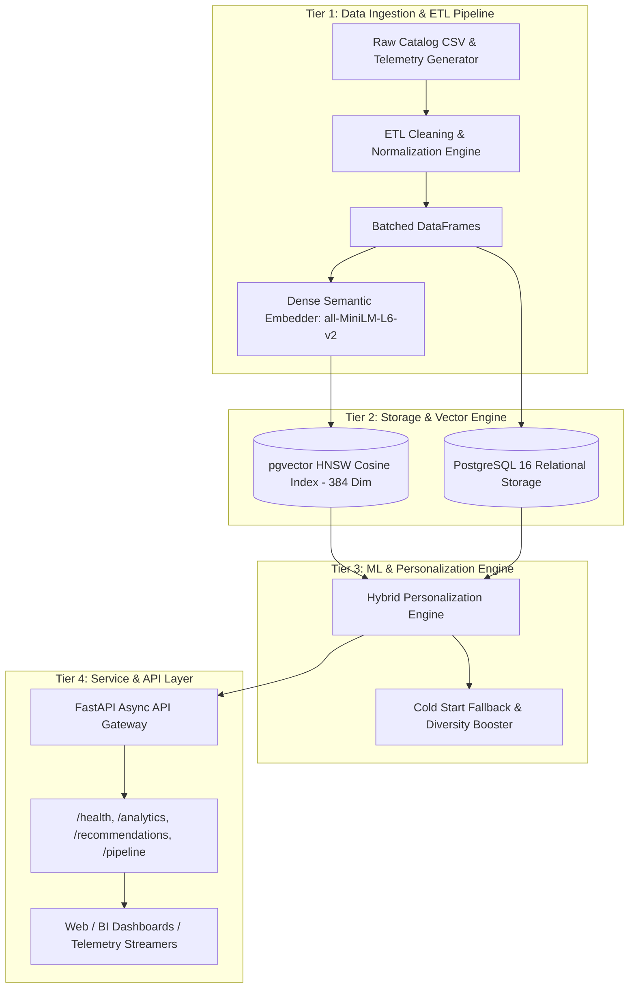

# System Architecture & Technical Specifications

## Executive Summary
The **Netflix Streaming Intelligence & Personalization Platform** is an enterprise-grade, four-tier data engineering and machine learning platform designed for high-throughput streaming telemetry analytics and real-time personalized recommendations.

---

## 1. Multi-Tier Platform Topology

---

## 2. Component Specifications

### Tier 1: Ingestion & ETL Pipeline (`pipeline/etl.py`)
* **Data Cleansing:** Normalizes multi-format date strings into standard ISO-8601 (`YYYY-MM-DD`), imputes missing attributes (`Unknown Director`, `Unknown Cast`, `Global / International`), and handles categorical type casting.
* **Schema Integrity:** Deduplicates titles on `show_id` and bounds numerical properties (`release_year` $\in [1900, 2026]$, `watch_duration_pct` $\in [0, 100]$).
* **Synthetic Telemetry Generator:** Generates high-fidelity user interaction events (`watch`, `like`, `save`, `skip`) modeled using Gaussian and Poisson distributions reflecting realistic user personas (Binge Watchers, Genre Purists, Casuals).
* **Batch Upserting:** Employs PostgreSQL `ON CONFLICT (show_id) DO UPDATE` for zero-downtime catalog updates.

### Tier 2: Database & Storage (`data/schema.sql`)
* **Relational Core:** Structured storage for catalog items with foreign-key constraints on clickstream logs and embedding tables.
* **Dense Vector Extension (`pgvector`):** Extends PostgreSQL 16 with native vector types (`vector(384)`).
* **HNSW Indexing:** High-dimensional vector indexing using Hierarchical Navigable Small World (HNSW) graphs with cosine distance (`<=>`), providing $O(\log N)$ approximate nearest neighbor search latency ($< 5\text{ms}$ at scale).

### Tier 3: Recommendation Engine (`models/recommender.py`)
* **Semantic Embeddings (`models/embedder.py`):** Transformer-based dense embeddings (`sentence-transformers/all-MiniLM-L6-v2`) mapping synopses, genres, directors, and cast into a unified 384-dimensional latent semantic space.
* **Hybrid Scoring Function:**
  $$\text{FinalScore} = w_{sem} \cdot S_{cos}(\vec{v}_u, \vec{v}_c) + w_{genre} \cdot J_{genre}(G_u, G_c) + w_{dir} \cdot \mathbb{I}(D_c \in D_u) + w_{cast} \cdot J_{cast}(C_u, C_c)$$
* **Dual-Mode Cold Start Mitigation:**
  1. *Cold User:* Recommends top-engagement global tentpoles with balanced cross-genre diversity.
  2. *Cold Title:* Identifies semantic nearest neighbors via latent vector proximity + genre clustering.

### Tier 4: Backend API Layer (`api/main.py`)
* **Framework:** High-performance asynchronous FastAPI with Pydantic V2 data validation.
* **Endpoints:**
  - `GET /health`: Database, vector extension, and model readiness status.
  - `GET /analytics/summary`: Aggregate analytics on content distribution, top genres, and engagement.
  - `POST /recommendations/semantic`: Natural language prompt vector search.
  - `GET /recommendations/user/{user_id}`: Real-time personalized recommendation feed.
  - `POST /pipeline/simulate-stream`: Push telemetry clickstream events for instant user profile updates.

---

## 3. Latency & Scalability Characteristics
| Component | Metric | Target SLA |
| :--- | :--- | :--- |
| Semantic Vector Search (pgvector HNSW) | Latency | $< 12\text{ms}$ |
| Hybrid Scoring (Top-50 Candidates) | Latency | $< 25\text{ms}$ |
| Telemetry Stream Ingestion (Batch) | Throughput | $> 5,000\text{ events/sec}$ |
| Database Connection Pool | Capacity | 20 concurrent connections / worker |
