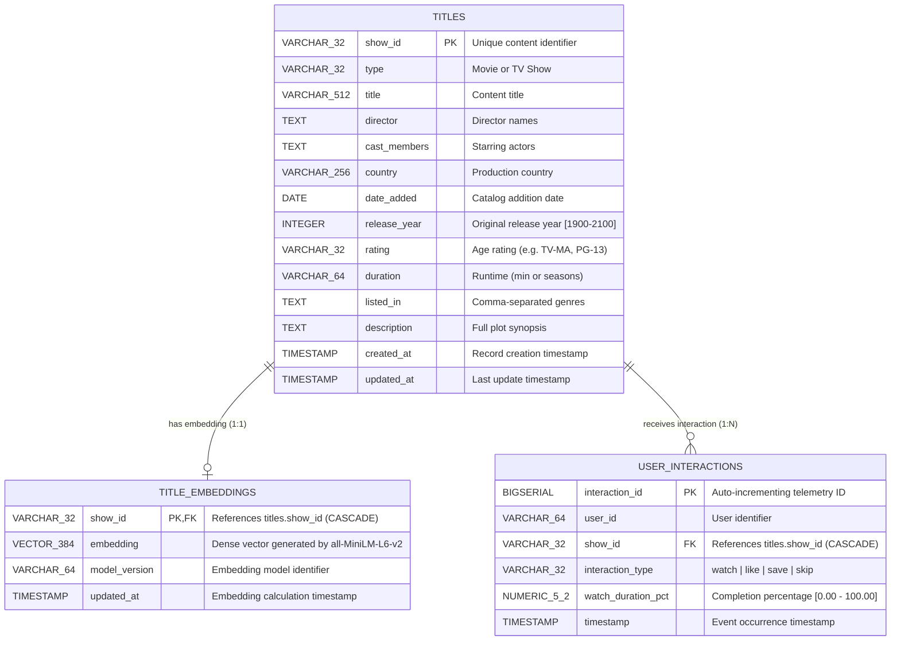

# Database Architecture & Entity-Relationship Diagram (ERD)

## 1. Entity-Relationship Diagram (Mermaid)

---

## 2. Table Schemas & Indexing Strategy

### `titles` Table
* **Primary Key:** `show_id` (VARCHAR 32)
* **Indexes:**
  - `idx_titles_release_year` on `release_year` (B-Tree)
  - `idx_titles_type` on `type` (B-Tree)
  - `idx_titles_country` on `country` (B-Tree)
  - `idx_titles_rating` on `rating` (B-Tree)

### `title_embeddings` Table
* **Primary Key:** `show_id` (VARCHAR 32, FK to `titles.show_id` ON DELETE CASCADE)
* **Vector Index:**
  - `idx_title_embeddings_hnsw` on `embedding` USING `hnsw (embedding vector_cosine_ops) WITH (m = 16, ef_construction = 64)`
  - *Rationale:* HNSW provides sub-linear $O(\log N)$ search latency with high recall ($>98\%$) compared to IVFFlat, eliminating periodic index rebuild requirements.

### `user_interactions` Table
* **Primary Key:** `interaction_id` (BIGSERIAL)
* **Foreign Key:** `show_id` referencing `titles.show_id` (ON DELETE CASCADE)
* **Composite Indexes:**
  - `idx_user_interactions_user_time` on `(user_id, timestamp DESC)` for rapid extraction of a user's recent watch history in chronological order.
  - `idx_user_interactions_show` on `show_id` for item-level engagement aggregation.
  - `idx_user_interactions_type` on `interaction_type` for filtering explicit feedback (`like`, `save`).
